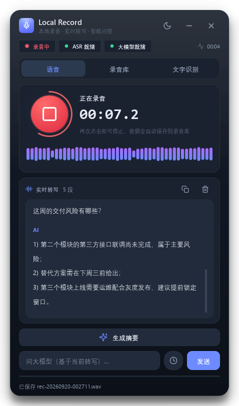
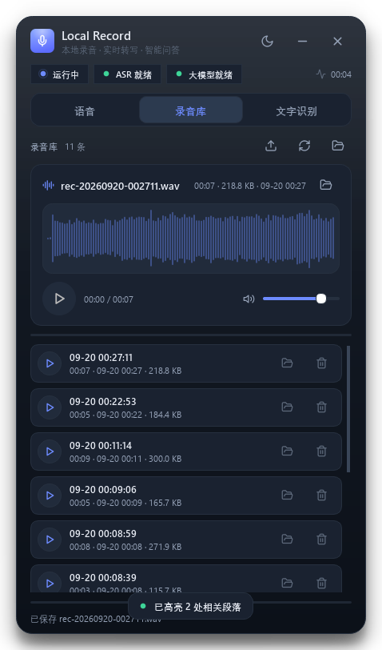
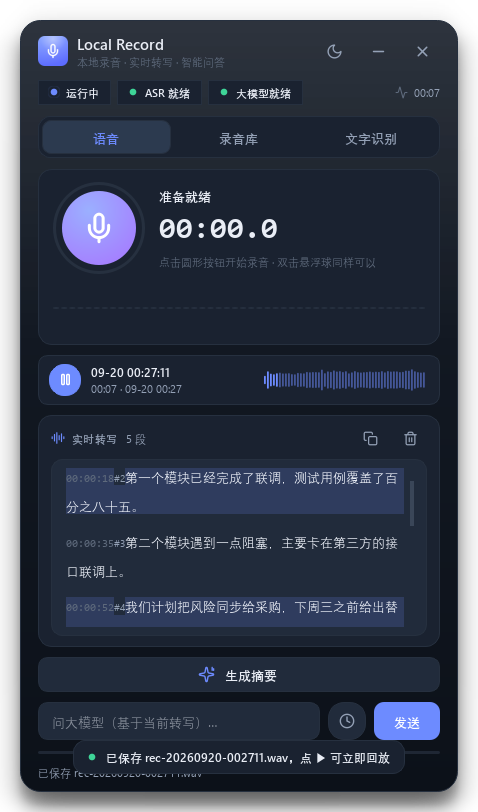
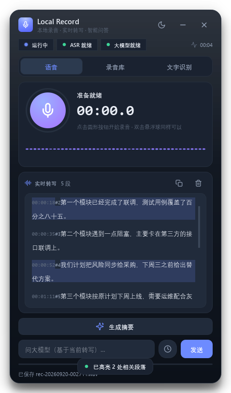
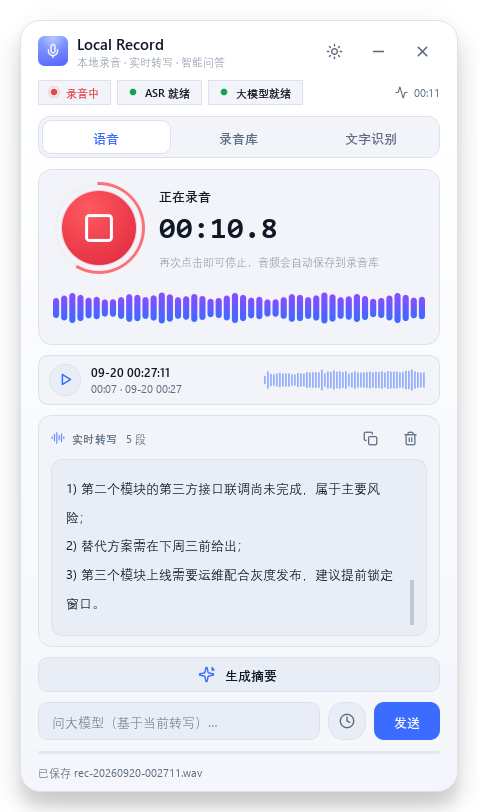
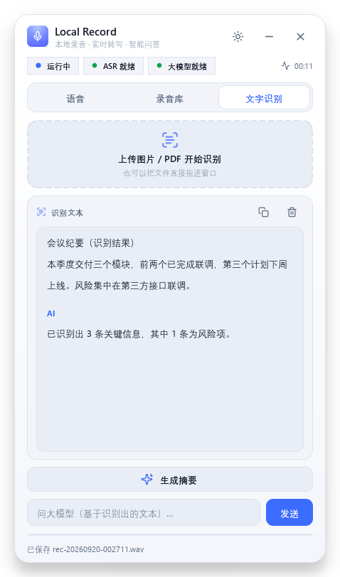

# Local Record（Windows 版）复现指南

> 目标：在一台干净的 Windows x64 上，从零复现「本地录音 → ASR 实时转写 + 本地 LLM 问答 + 本地 OCR」桌面 app，并打包成可分发的 zip / 安装器。
> 本文件包含：构建流程、环境要求、**Windows 版打包坑及修复**、验证清单、分发注意事项。
> 与 macOS 版（`package_dmg.sh`）同构；四坑的 Windows 对应关系见第 5 节。

---

## 1. 项目是什么

- 功能：悬浮球 + 托盘 app。点录音 → 麦克风采集 → SenseVoice（sherpa-onnx）边录边转写；本地 llama-server（llama.cpp）跑 Qwen GGUF 提供摘要/问答/时间定位；PaddleOCR（PP-OCRv6）识别图片/PDF；**录音库可试听（波形 + 定位 + 音量）**。
- 技术栈：Python 3.13 + PySide6 + sounddevice + sherpa-onnx + paddleocr/paddlex + onnxruntime + httpx + PyInstaller。
- 打包形态：PyInstaller **onedir**（不用 onefile：3G+ 体积解压慢且易被杀软拦截）→ `LocalRecord.exe` + 同级 `storage/`（自包含绿色版）→ zip / Inno Setup 安装器。用户机器无需 Python。
- 目录结构：

```
project/
├── config.yaml              # 模型文件名、端口、超时、prompt 模板、主题、播放
├── requirements.txt
├── LocalRecord.spec         # PyInstaller 配置
├── app/                     # 应用代码（python -m app.main 可开发运行）
│   ├── theme.py             # 设计令牌 + 全局 QSS（深色/浅色一键切换）
│   ├── widgets.py           # 自绘控件：录音按钮/电平条/状态胶囊/浮层提示
│   ├── player.py            # 播放引擎（sounddevice 输出流 + 波形包络）
│   ├── waveform.py          # 波形视图（点击定位、悬停时间）
│   ├── library.py           # 录音库（播放器卡片 + 列表 + 导入/删除）
│   ├── recorder.py          # 采集 + 实时电平 + wav 落盘
│   ├── main_window.py       # 主窗口（语音 / 录音库 / 文字识别 三页）
│   ├── ball.py / tray.py    # 悬浮球 / 托盘（状态色 + 运行提示）
│   └── main.py              # 入口 + 全局编排
├── scripts/
│   ├── package_windows.sh   # 打包脚本（Git Bash 运行）
│   ├── check_resources.py   # 资源检查（不下载）
│   ├── fix_runtime.py       # 4a/4b DLL 修复
│   ├── verify_frozen.py     # 4c/4d 冻结环境自检
│   ├── preview_ui.py        # 【开发】离屏渲染界面截图（build/preview/*.png）
│   ├── check_audio.py       # 【开发】录音/播放链路自检
│   ├── check_ocr_offline.py # 【开发】确认 OCR 完全离线（无下载）
│   ├── smoke_app.py         # 【开发】整机冒烟（隔离目录里跑真实 app）
│   └── check_zip.py         # 【开发】校验分发包 zip 完整（CRC 全量）
├── installer/LocalRecord.iss
└── storage/                 # 模型资源（你手动放入，见第 3 节）
```

## 1.1 界面与播放（本轮更新）

**界面**：深色玻璃拟态为主（可切浅色），三段式 `语音 / 录音库 / 文字识别`，
无边框圆角卡片 + 外阴影，所有颜色集中在 `app/theme.py`，点标题栏 ☀/☾ 即可换肤
（选择写入 `QSettings`，下次启动沿用）。

| 录音中（深色） | 录音库 / 试听（深色） |
|---|---|
|  |  |

| 停录后立即回放 | 时间定位高亮 |
|---|---|
|  |  |

| 录音中（浅色） | 文字识别（浅色） |
|---|---|
|  |  |

> 截图由 `scripts/preview_ui.py` 离屏渲染生成（`build/preview/*.png`），
> 换界面后可一键重出图对比。

**悬浮球（本轮改简）**：**单击直接进主界面**（原来单击会弹一长串菜单），
拖动可换位置（位置记忆），**右键**只留 3 项：`开始/停止录音`、`打开主界面`、`退出`；
托盘菜单仍然功能齐全（主题、录音库、上传识别、数据目录…）。
验证脚本：`scripts/check_ball.py`（跑真实 app，合成一次真实左键点击，
断言"点击前主窗口隐藏 → 点击后可见"，并检查右键菜单项数 ≤ 4）。

**录音 → 播放闭环**：

| 能力 | 位置 | 说明 |
|---|---|---|
| 录音 | 语音页圆形按钮 / 托盘菜单 / 悬浮球右键 | 录音时按钮外圈显示实时电平弧 |
| 落盘 | 自动 | `%APPDATA%\LocalRecord\recordings\rec-<时间戳>.wav` |
| 立即回放 | 语音页"最近一次录音"小卡片 ▶ | 停录后自动出现，一键试听 |
| 完整播放器 | 录音库页 | 波形（点击/拖动定位、悬停显示时间）+ 播放/暂停 + 进度 + 音量 + 定位文件 |
| 管理 | 录音库页 | 单击整行试听、导入 wav（也可直接拖文件进窗口）、删除、刷新 |
| 自动回放 | `player.autoplay_after_stop: true` | 默认关闭；开启后停录即回放 |

**"看得出在运行"的状态指示**：

- 标题下三枚状态胶囊：`运行中/录音中/处理中`（呼吸点）、`ASR`（加载时旋转环）、`大模型 xx%`，右侧还有程序运行时长；
- 录音卡：大计时器（0.1s 精度）+ 44 根实时电平柱 + 按钮呼吸光环；
- 忙碌时底部有来回流动的进度线，底部活动行显示"正在录音…/大模型正在总结…/已保存 xxx.wav"；
- 托盘图标随状态换色（空闲蓝紫 / 录音红 / 准备中橙），悬浮球录音时红橙渐变 + 扩散光环 + 电平外圈，且位置会被记住；
- 所有耗时操作都有轻量浮层提示（Toast），不再动不动弹模态框。

**开发自检脚本**（都不参与打包）：

```bash
.venv/Scripts/python.exe scripts/preview_ui.py    # 生成 build/preview/*.png 界面截图
.venv/Scripts/python.exe scripts/check_audio.py   # 录音电平/落盘/播放/定位/结束信号
.venv/Scripts/python.exe scripts/check_ocr_offline.py   # OCR 是否真的离线（无下载）
.venv/Scripts/python.exe scripts/smoke_app.py     # 隔离目录跑真实 app（不启动大模型）
.venv/Scripts/python.exe scripts/check_zip.py dist/LocalRecord-windows-x64.zip
                                                  # 校验分发包 zip 完整（条目 + CRC 全量）
```

**本轮新增/变更的配置项**（`config.yaml`，旧配置缺字段会自动用默认值补齐）：

```yaml
ui:
  theme: "dark"                # dark | light（界面切换后以 QSettings 记录为准）
player:
  device: null                 # 输出设备；null = 系统默认
  volume: 0.8                  # 初始音量
  autoplay_after_stop: false   # 停止录音后是否自动回放
recorder:
  save_wav: true               # true=存进录音库；false=只落临时目录（可回放、自动清理）
```


## 2. 环境要求（构建机）

| 项 | 要求 | 说明 |
|---|---|---|
| Windows | x64（win10/11） | 目标架构 x64 |
| Shell | Git Bash | 打包脚本是 bash 脚本 |
| Python | **3.13 x64** | conda-forge（miniforge）或 python.org 均可；区别见坑 4b |
| 磁盘 | ≥ 15GB | 模型 ~3G + 打包中间产物大 |
| 依赖 | `requirements.txt` + pyinstaller | 脚本自动安装 |

关键版本（与 macOS 版一致）：PyInstaller 6.21、opencv-contrib-python 4.10.0、paddleocr 3.7.0、paddlex 3.7.2、PySide6 6.11.1、httpx 0.28.1、sounddevice 0.5.5。
llama-server 用 **b9000**（config.yaml 里 `release_tag: b9000`；win-x64 包，内置 CPU（AVX2）推理，无需显卡）。

## 3. 准备模型（本方案不下载任何内容）

`storage/` 目录骨架不需要手动建——运行 `python scripts/check_resources.py`（或直接跑打包脚本）会自动创建 `storage/` 及其子目录，并写入一份 `storage/README.md` 放置说明。然后把文件放进对应位置（本项目已实测下载过一套，国内源见下）：

| 路径 | 内容 | 下载来源（国内） |
|---|---|---|
| `storage/models/MiniCPM5-2B-Q4_K_M.gguf` | MiniCPM5-2B Q4_K_M GGUF（~1.45GB，本地大模型） | ModelScope / hf-mirror `OpenBMB/MiniCPM5-2B-GGUF`（需 llama.cpp **b11274+**） |
| `storage/bin/llama-server/llama-server.exe` + `ggml*.dll` | llama.cpp `llama-b11274-bin-win-cpu-x64.zip` 解压内容 | GitHub Releases（走 ghfast.top 等代理）；**注意资产名是 `win-cpu-x64`，不是 `win-x64`** |
| `storage/asr/paraformer/model.int8.onnx` + `tokens.txt` | **默认 ASR 引擎**：Paraformer zh int8（227MB，中英混说都认） | hf-mirror `csukuangfj/sherpa-onnx-paraformer-zh-2024-03-09` |
| `storage/asr/punct/model.onnx` + `tokens.json` | 标点恢复模型 CT-Transformer（285MB） | ModelScope `csukuangfj/sherpa-onnx-punct-ct-transformer-zh-en-vocab272727-2024-04-12` |
| `storage/ocr/official_models/PP-OCRv6_medium_{det,rec}_onnx/` | OCR 只用 **`_onnx`** 两个目录（engine=onnxruntime） | bcebos `paddlex/official_inference_model/paddle3.0.0/<模型名>_infer.tar`（国内直连） |

**默认不打包、按需再下**（为了控制体积，已实测确认用不到）：

| 路径 | 体积 | 说明 |
|---|---|---|
| `storage/asr/sense-voice/`（model.int8.onnx + tokens.txt） | 226MB | 备选 ASR，中英日韩粤多语种；中文与中英混说都不如 Paraformer，只有需要日/韩/粤时才下载。来源：hf-mirror `csukuangfj/sherpa-onnx-sense-voice-zh-en-ja-ko-yue-int8-2025-09-09`；下好把 `asr.backend` 改成 `sense_voice` |
| `storage/ocr/official_models/PP-OCRv6_medium_det/`、`..._rec/` | 133MB | **PaddlePaddle 格式**（`inference.pdiparams`）。走 ONNX 时用不到，删掉不影响 |
| `storage/ocr/official_models/UVDoc/` | 31MB | 文档去扭曲模型；`app/ocr.py` 里 `use_doc_unwarping=False`，用不到 |

> `config.yaml` 的 `model.filename` 必须与 `storage/models/` 里的文件名**完全一致**，`scripts/check_resources.py` 会校验。
> 模型放别的盘也行：设置环境变量 `LOCAL_RECORD_DIR` 指向含 `storage/` 的目录即可（开发版与打包版都认）。

> `config.yaml` 的 `model.filename` 必须与 `storage/models/` 里的文件名**完全一致**，`scripts/check_resources.py` 会校验。
> 模型放别的盘也行：设置环境变量 `LOCAL_RECORD_DIR` 指向含 `storage/` 的目录即可（开发版与打包版都认）。

## 4. 构建

**Windows 用户（推荐，双击即用）：**

```bat
run.bat                  ← 双击：开发模式运行（首次自动装依赖）
package_windows.bat      ← 双击：一键打包（内部调用 Git Bash）
package_windows.bat --skip-checks   ← 模型没放齐也能先出包
```

批处理已按 GBK + CRLF 编码，中文显示正常；自动在 PATH 和
`E:\Git` / `C:\Program Files\Git` / `D:\Git` 中定位 Git Bash。

**或用 Git Bash 手动执行（等价）：**

```bash
./scripts/package_windows.sh            # 完整构建
./scripts/package_windows.sh --skip-checks   # 模型还没放齐，先出包验证流程
```

脚本做的事（顺序很重要）：

1. 建/复用 `.venv`，装依赖 + pyinstaller
2. 资源检查（`check_resources.py`，**不下载**；缺失则列出放置说明并中止，除非 `--skip-checks`）
3. 清理 `build/`、`dist/`
4. PyInstaller 打包（`LocalRecord.spec`：`--noconsole` onedir；只对 paddleocr/paddlex/sherpa_onnx/cv2 做 collect-all，PySide6/numpy/onnxruntime 交给标准 hook，并 exclude 掉用不到的 Qt 家族与 tkinter —— 见"包体积"一节）
5. **4a~4d 打包后修复**（见下）
6. 复制 `storage/` 与 `config.yaml` 到 `dist/Local Record/`
7. 最终自检 `Local Record.exe --verify --deep`（**跑功能**：Qt 界面/PortAudio 输入输出/SenseVoice/OCR 真图识别/wav 回读，必须无 `FAIL`）
8. 生成 `dist/LocalRecord-windows-x64.zip`（用系统自带 bsdtar）；找到 `iscc` 则额外生成安装器

### 安装器（可选产物）

| | 说明 |
|---|---|
| 依赖 | **Inno Setup 6/7**。脚本按顺序找 `iscc`：PATH → `%LOCALAPPDATA%\Programs\InnoSetup6\` → `\Inno Setup 6\`（`Program Files (x86)` / `Program Files` / D 盘） |
| 产物 | `dist\LocalRecord-setup-<版本>.exe`（LZMA2 压缩，约 2.5 GB） |
| 中文界面 | Inno Setup **默认不带** `ChineseSimplified.isl`。放进编译器的 `Languages\` 即为中文，否则自动退回英文（`.iss` 里用 ISPP `FileExists` 判断，缺了也不会构建失败）。下载：<https://jrsoftware.org/files/istrans/ChineseSimplified.isl>，国内可用代理 `https://ghfast.top/https://raw.githubusercontent.com/jrsoftware/issrc/main/Files/Languages/ChineseSimplified.isl` |
| 权限 | `PrivilegesRequired=lowest`，装到 `%LOCALAPPDATA%\Programs\LocalRecord`，**不需要管理员**，卸载走「应用和功能」 |

> **授权提醒**：Inno Setup 6.7+ / 7 是「非商用免费」，**商用需购买许可证**（ISCC 启动横幅会打印
> `Non-commercial use only`，官方说明见 <https://jrsoftware.org/isdl.php> 的 "Using Inno Setup commercially?"）。
> 如果这个 app 要商用分发，请改用许可宽松的打包器（如 NSIS），或只发绿色版 zip。
>
> 脚本里已修复的两个 `.iss` 坑（都是相对路径/exe 名引起的，之前构建必失败）：
> `MyAppExeName` 少了个空格（真实 exe 是 `Local Record.exe`）；`OutputDir`/`SetupIconFile`
> 是相对**脚本所在目录**解析的，所以分别应为 `..\dist` 和 `LocalRecord.ico`。

安装器自检（可手动复核，不修改「应用和功能」以外的东西）：

```powershell
$setup = "dist\LocalRecord-setup-1.0.0.exe"
Start-Process $setup -ArgumentList "/VERYSILENT","/SUPPRESSMSGBOXES","/NORESTART","/DIR=$env:TEMP\lr-test","/NOICONS" -Wait
Test-Path "$env:TEMP\lr-test\Local Record.exe"        # 应为 True
& "$env:TEMP\lr-test\unins000.exe" /VERYSILENT /SUPPRESSMSGBOXES   # 卸载干净
```

### 包体积（2026-09 精简后）

| | 精简前 | 精简后 |
|---|---|---|
| `_internal/` | 0.94 GB | **约 0.4 GB** |
| 绿色版目录合计 | 3.85 GB | 约 3.3 GB（其中 2.88 GB 是模型） |
| `LocalRecord-windows-x64.zip` | 3.02 GB | 约 2.5 GB |

主要原因：旧 spec 对 `PySide6` 做 `collect_all`，把 Qt3D / QtWebEngine / QtQuick /
QtMultimedia / QtCharts 等**完全用不到**的模块（实测 634 MB）一起打了进去；此外还带上了
numpy 测试套件、onnxruntime 的 tools/transformers、tkinter。本项目实际只用到
`QtCore / QtGui / QtWidgets / QtSvg`，交给 PyInstaller 自带的 PySide6 hook 按需收集即可。
每次精简都由 `--verify --deep` 在**真实冻结环境**里跑功能验证，不是只看体积。

## 5. Windows 版四个打包坑（已修复，勿回退）

### 坑 1：cv2 加载失败 / `DLL load failed`（对应 macOS 的 cv2 递归）

- **机制**：opencv 4.10+ 在 Windows 的 wheel 同样是 `__init__.py` + 原生扩展（`cv2.abi3.pyd`）。PyInstaller onedir 下若 loader 重导入自身会递归；更常见的是原生扩展依赖的 **MSVC 运行库**（`vcruntime140.dll` / `vcruntime140_1.dll` / `msvcp140.dll`）没被收集或版本不对 → `DLL load failed while importing cv2`。
- **修复（脚本 4a）**：`fix_runtime.py` 从构建环境（`sys._base_executable` 所在目录 / `Library/bin`）把三个运行库复制进 `_internal/`；`verify_frozen.py --fix-cv2` 若发现 cv2 导入失败，自动把 `_internal/cv2/__init__.py` 换成引导模块（直接 `importlib.util.spec_from_file_location("cv2", ...)` 加载同目录 `cv2.abi3.pyd`/`cv2.pyd`，模块名必须是 `"cv2"` 才能对上 PyInit 符号，原文件备份为 `__init__.py.pyinstaller-bak`）。paddleocr/paddlex 只用顶层 cv2，引导模块够用。

### 坑 2：LLM 永远无法就绪——`import ssl` 失败（对应 macOS 的 `_SSL_SESSION_get_time_ex`）

- **症状**：llama-server 进程正常、`curl http://127.0.0.1:8091/v1/models` 有返回，但 app 的 httpx 请求连接前瞬间失败，AI 按钮永远灰。
- **机制**：**conda-forge** Python 的 `_ssl.pyd` 动态链接 `libssl-3-x64.dll` / `libcrypto-3-x64.dll`；PyInstaller 可能收集到别的包自带的旧版 OpenSSL DLL → `_ssl` 加载失败 → `import ssl` 崩 → httpx/httpcore 模块级 `import ssl` 全灭。**python.org** 官方 Python 把 OpenSSL 静态链进 `_ssl.pyd`，无此坑。
- **修复（脚本 4b）**：`fix_runtime.py` 用构建环境 `Library/bin` 的 `libssl-3-x64.dll` / `libcrypto-3-x64.dll` **覆盖** `_internal/` 下的副本（OpenSSL 3.x ABI 兼容）；python.org 环境找不到源文件则跳过（正常）。自检里 `verify_frozen.py` 的 `import ssl` + httpx 必须 PASS，失败即构建中止。

### 坑 3：麦克风不弹授权框 / 录到静音（对应 macOS 的 TCC）

- **机制**：Windows 没有 TCC，但同样有两个关卡：① 系统设置「隐私和安全性 → 麦克风 → 允许桌面应用访问你的麦克风」关闭时**不弹窗**且录到静音；② 打包版若丢了 sounddevice 的 **PortAudio DLL**（`libportaudio64bit.dll`，包内数据文件），采集直接报 PortAudioError。
- **修复（脚本 4d + app）**：spec 里由 `hook-sounddevice` 收集 PortAudio DLL，并额外**显式**把
  `_sounddevice_data/portaudio-binaries/libportaudio*.dll` 钉进包（不依赖 hook 行为）；
  `--verify --deep` 会真的开一次输入/输出流（录音与**回放**都走 PortAudio），
  `verify_frozen.py` 另检查 `_internal` 下存在 `libportaudio*.dll`；
  app 的 `recorder.py`/`player.py` 捕获 PortAudioError 并弹窗引导去 Windows 设置。
- 注意：**授权弹窗只会在第一次点「开始录音」时出现**，不是打开 app 时；Win11 首次采集会弹隐私提示，允许即可。

### 坑 4：LLM 启动慢（30s~2min）导致超时/按钮灰

- **机制**：llama-server 每次启动要加载 2.7GB 模型；原 90s 超时在机器忙时会竞态失败；超时后无重试、无进度反馈。
- **修复（app 代码）**：
  - `app/llama_server.py` `wait_until_ready`：`startup_timeout_sec` 只用于进度估算，**进程还活着就继续等**（硬上限 `hard_timeout_sec` 600s）；`on_progress` 回调上报进度；支持 `should_stop`（退出时立刻中断等待）。
  - `app/warmup.py`：启动期间按比例报进度（界面显示「本地大模型加载中 X%」）。
  - `config.yaml`：`startup_timeout_sec: 300`。
  - 健康检查异常不再吞掉：记录异常并每 30s 打一次日志（`app.log` 里搜「健康检查失败」）。

## 6. 打包后自检（脚本已内置，手动可复核）

自检分两级，都在**真实 exe**里跑（不是模拟 sys.path）：

```bash
"dist/Local Record/Local Record.exe" --verify          # 一级：导入 + 音频设备枚举
"dist/Local Record/Local Record.exe" --verify --deep   # 二级：跑功能（打包脚本第 7 步用的就是它）
```

二级（`--deep`）会真跑这些事，结果写进 `%APPDATA%\LocalRecord\logs\verify.log`：

| 检查 | 说明 |
|---|---|
| 存储/配置解析 | 冻结版应解析到 exe 同级的 `storage/` |
| llama-server 可执行 | 真的执行 `llama-server.exe --version` |
| Qt 界面·图标·渲染链路 | 起 offscreen 窗口：建 `MainWindow`、切深/浅主题、渲染 SVG 图标、写入转写/问答/OCR 文本并断言 HTML 正确、更新录音计时与电平 |
| 麦克风采集 / 扬声器输出 | 真的开 PortAudio 输入流读 100ms、输出流写 100ms（构建机没设备只记 `WARN`，不算失败） |
| ASR 模型加载与识别 | 加载 SenseVoice 识别 1s 合成音频 |
| OCR 真实图片识别 | 用 PIL 现场生成带大字的图片 → 走完整 ONNX 识别链路 → **断言识别出关键词**，并检查模型确实来自本地 `storage/ocr` |
| 录音 wav 回读 | wave + numpy + `AudioClip.peaks()` 包络 |

判定：日志里出现 `FAIL` 即构建失败（脚本中止）；`WARN` 只提示（例如构建机没插麦克风）。

## 6.1 模型选择与性能（8GB 内存笔记本实测）

测试机：**i5-8250U（4C/8T）+ 7.9GB 内存 + SATA SSD**，llama.cpp **b9000**，ctx 8192，
任务是把 10 段会议转写做中文摘要（就是 app 里的 `prompts.summarize`）。

| 方案 | 体积 | 冷启动 | 热启动 | 预填充 | 生成 | 峰值内存 | 摘要效果 |
|---|---|---|---|---|---|---|---|
| Qwen3-4B Q4_K_M（原配置） | 2.33 GB | 56.9s | — | 16.8 tok/s | 4.32 tok/s | 3.24 GB | 基线（好） |
| **Qwen3-4B + KV量化 + FA（当前配置）** | 2.33 GB | **33.1s** | **14.3s** | 19.8 tok/s | 4.45 tok/s | **2.94 GB** | 与基线一致（实测更完整） |
| Qwen3-1.7B Q4_K_M | 1.03 GB | **6.9s** | — | 52.4 tok/s | **9.61 tok/s** | 2.65 GB | 略降，摘要仍完整 |
| MiniCPM5-2B Q4_K_M | 1.45 GB | ✗ 加载失败 | — | — | — | — | 需升级 llama.cpp |

**为什么慢**：这台机器上"模型大小"只是原因之一，**KV cache 同样是 1 GB 级开销** ——
Qwen3-4B 是 36 层 × 8 KV heads，8192 上下文下 f16 KV ≈ **1.18 GB**（合计 3.5GB，
而系统只余 1~3GB 可用 → 换页）。所以当前配置用 `-ctk q8_0 -ctv q8_0 -fa on`
把 KV 压到约 0.6GB，**效果不变而冷启动快 42%**。改回 `extra_args: []` 即还原。

> Qwen3-1.7B 为什么内存没省多少？因为它同样是 8 KV heads，KV ≈0.94GB；
> 4B 量化后 KV 反而更小。**真正省内存的是 KV heads 少的模型**（见 MiniCPM5-2B 只有 2 个）。

**MiniCPM5-2B（面壁最新 2B）实测结论**：GGUF 声明 `architecture=llama`（架构本身
b9000 支持），但 `tokenizer.ggml.pre = "minicpm5"` 是 b9000 不认识的预分词器：

```
error loading model vocabulary: unknown pre-tokenizer type: 'minicpm5'
```

它的正则与 b9000 内置的 **qwen2 正则只差数字分组**（`\p{N}+` vs `\p{N}`）。
虽然可以用 `--override-kv tokenizer.ggml.pre=str:qwen2` 强行加载，但切词会变
（"85%" 之类），属于**静默掉效果**，不建议。正路是升级 llama.cpp 到认识 `minicpm5`
的版本（`storage/bin/llama-server/` 换新包后，`--verify --deep` 会重新验证）。

**换模型怎么做**（无需重新打包）：

```yaml
model:
  filename: "Qwen3-1.7B-Q4_K_M.gguf"   # 把文件放进 storage/models/ 并改这一行
```

**相关工具**（都不参与打包）：

```bash
.venv/Scripts/python.exe scripts/gguf_meta.py <模型.gguf>     # 先看架构/上下文/KV heads/模板，避免白下几 GB
.venv/Scripts/python.exe scripts/bench_llm.py --all           # 跑分：冷启动/预填充/生成/峰值内存
.venv/Scripts/python.exe scripts/bench_llm.py <m.gguf> --server-args "-ctk q8_0 -ctv q8_0 -fa on"
.venv/Scripts/python.exe scripts/check_llm_app.py             # 走 app 真实链路（LlamaServer+LLMClient+摘要模板）
.venv/Scripts/python.exe scripts/download_gguf.py             # 从 ModelScope 下候选 GGUF 到 build/models-test/
.venv/Scripts/python.exe scripts/compare_pretokenizer.py      # 对比模型预分词正则与 llama.cpp 内置正则
```


### OCR 完全离线（重要机制，勿改顺序）

`PADDLE_PDX_CACHE_HOME` 必须在 **`import paddlex` 之前**指向 `storage/ocr`：paddlex 在
import 时就把缓存根定死了，之后再设环境变量无效，那时它会退回 `~/.paddlex` 并在本地找不到
模型时**联网下载**。因此 `app/ocr.py` 在**模块导入时**就调用 `configure_offline_cache()`
（`app.main` 启动即 import 本模块，早于任何 OCR 动作），`OCREngine.init()` 里再兜一次，
同时设 `PADDLE_PDX_DISABLE_MODEL_SOURCE_CHECK=True` 跳过联网探测（离线包不需要，还能少等几秒）。

> 验证方法：`.venv/Scripts/python.exe scripts/check_ocr_offline.py`
> —— 它把缓存指向 `storage/ocr` 后跑一次真图识别，并检查输出里**没有** "Downloading" 字样。

## 7. 运行时验证与排障

### 「说了很多话却没有内容」——先看是不是麦克风根本没收到人声

实测踩过一次：用户说了 24 分钟，**一个字都没识别出来**。最后定位到**不是 ASR、不是模型**，
而是**系统输入根本没有语音频段**：

| 录音 | 1.5kHz 以上能量占比 |
|---|---|
| 能正常识别的录音（10:15） | **36~47%** |
| 出问题时录的 24 分钟 | **0/145 个 10 秒窗口超过 8%**（最高 7.6%） |

判断方法（不用说话也能测，因为正常麦克风本底噪声就有明显高频）：

```bash
.venv\Scripts\python.exe scripts\check_mic.py        # 逐设备看 RMS/峰值/高频占比
.venv\Scripts\python.exe scripts\check_asr_live.py 15 4   # 实时电平 + 出段情况（对着麦克风说）
```

`check_mic.py` 里高频占比 **<8%** 就说明该输入设备在当前设置下收不到人声频段。常见原因：

1. **默认输入切到了没有麦克风的设备**（蓝牙耳机、HDMI 显示器、立体声混音、耳机孔的悬浮输入）；
2. **硬件麦克风静音键**（很多笔记本 F4/F8 上的麦克风图标键，带指示灯），或 mic 被遮挡/贴住；
3. **麦克风音量被拉到很低而「麦克风加强」很高** —— 放大的是底噪，不是人声；
4. **声音设置里的「音频增强 / 噪音抑制 / 回声消除」**（Realtek APO 或会议软件的降噪）把语音削掉。

排除方法：声音设置 → 系统 → 声音 → 输入，对着麦克风说话看**系统自带的电平条是否跳动**；
不跳就是系统/硬件层面没收到，跟本 app 无关。修好后可用 `check_asr_live.py` 复测，
它会打印实时电平和识别出的文本。

**app 侧的对应改进**（避免再"静默失败"）：

* 连续 3 段检测不到人声 → 弹提示 + 活动行警告 + 日志 WARNING
  （`ASRWorker.noVoice` 信号 → `app/main.py` 的 `on_no_voice`）；
* 电平条只统计 **2kHz 以上**人声频段（`app/recorder.py` 的 `LEVEL_BAND_HZ`），
  否则低频轰鸣会把电平条顶满、看不出"我说话有没有被采到"；
* **停止录音时 flush**（`ASRWorker.flush()`）：不足一段（默认 8 秒）的录音也会被转写，
  否则"说几秒就停"一个字都不会出（这个坑实测踩过）。

### 会议纪要（不是"摘要"）

`prompts.summarize` 已改成**会议纪要模板**：`一句话概述 / 一、重点内容 / 二、待办事项（表格：事项·负责人·时间要求）
/ 三、风险与问题 / 四、决议与结论`，并明确要求"只依据转写、不许编造"，没提到的写「未提及」。
按钮文字同步改为「生成会议纪要」（图标换成清单）。

> 提示词写法上的坑：**要求要写在模板之前、模板里的字段要留空**。
> 曾把说明写在字段后面（`**一句话概述**：（30 字以内…）`），2B 模型会把括号里的说明
> 原样抄进正文；改成"先列要求、再给空模板"后就正常了（实测输出见下）。

**Markdown 渲染**：模型输出的是 Markdown，而界面是 QTextBrowser，原先只做转义+换行，
会看到一堆 `##`、`**`、`|`。新增 `app/md.py`（极简转换，先转义再套标签，防注入），
支持标题 / 加粗 / 列表 / 表格，会议纪要在界面上是真表格。
自检：`scripts/check_delete.py` 类似的小脚本可直接跑 `app.md.to_html` 的 8 项断言。

### 文字识别页：只有问答，没有摘要

识别结果的主要用途是"就文档提问"，所以：

* **移除了「生成摘要」按钮**（`ocr_summary_btn` 及其接线一并删除）；
* 输入区明确标注为 **「文档问答」**，并加一行说明
  「在下面输入你想问的问题，AI 只依据上面识别出的文字回答（不用先做摘要）」；
* 输入框占位示例：`在这里输入问题，例如：这份合同的付款方式和期限是什么？`；
* 按钮文字：**提问**（原来叫"发送"，看不出是干什么的）。

> 取名考虑：叫「文档问答」而不是"问大模型/智能问答"，是因为用户需要一眼明白
> **这里能输入文字去问识别出来的内容**；配一句说明 + 一句示例占位，避免再出现
> "不知道能提问"的情况。

### 录音删除：被占用也能删掉

`app/library.py` 的删除逻辑按顺序处理：释放自身引用 → 文件已不存在按已删除 → 去只读属性
（`WinError 5`/`EACCES`）→ 针对占用重试 6 次 → 仍失败则询问用户，可点
**「下次启动时删除」**：该行立即从列表消失，路径写进 `%APPDATA%\LocalRecord\pending_delete.txt`，
下次启动 `process_pending_deletes()` 自动清除（失败会保留到再下次）。

覆盖的自检（`scripts/check_delete.py`）：正常删除 / 文件已不存在（陈旧行）/ 只读文件 /
被占用（延后删除 + 清单清理）/ 清单内文件不出现在列表。

### 录音回听声音小：落盘时做整体增益归一化

实测用户录音（说话帧电平）：早上 **-15dBFS**，下午变成 **-25dBFS** —— 也就是说
**不是设备坏，是输入电平低**（把 Windows 麦克风音量/加强调低能减少底噪，但录进来的信号也小了）。
而旧版**落盘不做任何增益**，于是回听很小声（识别不受影响，因为识别链路本来就是按段归一化的）。

现在 `Recorder._save_wav()` 会做一次**整体增益归一化**（`app/recorder.py: _normalize_peak`）：

* 只乘一个系数 → 波形形状与动态完全不变，不会有压缩/失真；
* 目标峰值 **0.95（-0.4dBFS）**，最大增益 **+20dB**（防止把近乎静音的录音连底噪一起放大）；
* 峰值 < 0.005 视为静音，不动；本来就够响（增益 < 0.2dB）也不动；
* 实测效果：-10.9dBFS 的录音 → **-0.4dBFS**（说话帧 -24.8 → -14.3dBFS）；够响的录音只 +1~2dB；
* 关掉：`config.yaml` 的 `recorder.normalize_save: false`（想保留原始电平做声学分析时用）。

自检：`--verify --deep` 的「录音落盘增益（回听音量）」会验证
"偏小录音被提起来 / 极小声受上限保护 / 静音不放大 / 够响不大改"四种情况。

> **建议的麦克风策略**：Windows 里把麦克风音量调到 70~80、「加强」调低（底噪小），
> 让 app 的落盘归一化去补音量；这比把硬件电平拉高（连底噪一起放大）效果更好。
> 回听还嫌小的话，app 内播放器音量条（默认 0.8）可以拉到 100%。

### 没人说话却识别出文字（幻觉）：已修

用户实测：静音时转写区出现「吃葡萄不吐葡萄皮」「一一得一」「证证证证证证证证证」这类内容 ——
ASR 模型对着底噪硬凑出来的幻觉。修法是**识别前先判断这段到底有没有人声**：

| 手段 | 阈值/规则 | 依据（本机实测） |
|---|---|---|
| **静音判定**（`app/asr.py: speech_present`） | 噪声底以上帧占比 < **6%** → 不送识别 | 有人说话 **21%~63%**，纯噪声/静音 **0%~1%**（3 倍以上余量） |
| **重复字幻觉过滤**（`looks_like_hallucination`） | 连续 ≥4 个相同字 → 丢弃 | 「证证证证证证证证证」这类；3 连重复不丢，避免误杀「好好好」 |
| 语气词/空结果过滤（`is_meaningless`） | 只有「嗯/啊/呃…」→ 丢弃 | 原有逻辑保留 |

> **为什么不用 Silero VAD**：实测 `silero_vad.onnx`（sherpa-onnx 的 `VoiceActivityDetector`）
> 在本机 6 个样本上错 1 个 —— 63 秒真实录音被判成"无人声"、阈值调低又在静音上误报；
> 自适应能量法 **6/6 全对**，而且先做了一阶差分（高通），对低频轰鸣不敏感。
> VAD 模型因此没有打包（省 2.3MB，也不引入额外依赖）。

**回归检查**：`scripts/check_hallucination.py`（12 项）与 `--verify --deep` 里的
「静音不产生文字（幻觉防护）」；其中最有说服力的两条是**走 app 真实链路**：

```
[PASS] app 链路：40 秒纯噪声 → 0 段
[PASS] app 链路：真实语音照常出段 —— 命中 11/12：今天的会议改到下午三点，请大家准时参加。
```

阈值想调：`config.yaml` 的 `asr.speech_min_ratio`（漏掉极短插话就调小到 0.03，幻觉多就调到 0.10）。

### 中英混说也能识别（实测修正了一个错误结论）

一开始我以为 Paraformer zh「只支持中文」，实测**不成立**：它能正确转写夹杂的英文（小写拉丁字母），
而且比 SenseVoice 更准。同一段中英混说音频（212 字，8 秒切分）：

| 引擎 | 混说 CER | 用时 | 英文表现 |
|---|---|---|---|
| **Paraformer zh int8（默认）** | **12.3%** | 1.8s | `first the api response time must be under two hundred …`（词基本正确） |
| SenseVoice int8（zh / auto） | 68.9% | 2.4s | 全大写且错词多：`RESPONE`/`MIL`/`RGRESSION` |
| Whisper base int8 | 78.3% | 7.1s | **英文整句被丢掉**，中文还输出繁体 |
| Whisper small int8 | 80.2% | 21.4s | 同上 |

（CER 按字符算，英文大小写/空格差异会被放大，看**识别文本**更直观。）

结论：**默认 Paraformer 就满足"中英文都识别"**，不需要换成 SenseVoice/Whisper；
真要英文为主（长段英文演讲）再改 `asr.backend: sense_voice`。
复现：`scripts\check_asr_bilingual.py`（自动合成中英混说测试音频：中文 Huihui、英文 Zira 分别合成后拼接）。

### 录音噪声大：怎么解决（附实测：软件降噪基本没用）

用**本机真实噪声**（实测 RMS -18 dBFS，非常吵）叠加到已知文本语音，+3dB 信噪比下：

| 处理 | CER |
|---|---|
| 原始 | **10.4%** |
| 高通 120Hz | 12.7%（更差） |
| 高通 + 谱减降噪 | 9.9%（仅 0.5 个百分点，在波动内） |

**所以没有把 DSP 降噪加进链路** —— 模型抗噪已经很稳，加降噪只是更慢、还可能削掉语音；
噪声主要影响**你听录音的体验**，而不是识别率。真要做神经降噪，sherpa-onnx 有
`OfflineSpeechDenoiser`（GTCRN / DpdfNet）接口，但 hf-mirror 上没有现成的 sherpa 兼容权重。

**优先级最高的解决顺序**（都在系统里改）：

1. **换耳麦/USB 麦、离嘴 10~20cm** —— 通常直接把准确率从 85% 提到 95%+；
2. **把「麦克风加强」调低**：你的噪声 RMS 是 -18 dBFS，等于一直在满速放大底噪；音量 70~80、加强关掉；
3. **关掉「音频增强 / 噪音抑制 / 回声消除」**（Realtek APO 与会议软件会削语音、做 AGC 泵动）；
4. 笔记本别放在风扇出风口旁；
5. `scripts\check_mic.py` 逐个设备看底噪与高频占比，必要时在 `config.yaml` 的
   `recorder.device` 里写死设备索引。

**用你自己的声音量准确率**：照 `scripts\check_my_recording.py` 顶部那段念一遍再运行该脚本，
会给出整段 / 12 秒 / 8 秒 / 4 秒四种切分下的 CER。

### ASR 引擎：默认换成 Paraformer（中文更准，同体积更快）

`asr.backend` 可在 `paraformer`（默认）/ `sense_voice` 之间切换。实测同一段 60 秒中文会议语音
（209 字标准答案、8 秒切分）：

| 模型 | 体积 | 8 秒切分 CER | 用时 | 备注 |
|---|---|---|---|---|
| **Paraformer zh int8** | 227MB | **1.9%** | **3.3s** | 默认；中文最准，只支持中文 |
| SenseVoice f32 | 929MB | 2.9% | 5.6s | 多语种，全精度 |
| SenseVoice int8 | 226MB | 3.3% | 4.4s | 备选；中英日韩粤 |

差别肉眼可见：Paraformer 认对「联调 / 测试用例」，SenseVoice 会写成「联条 / 测试用力」。
复现：`scripts\compare_asr_models.py`（自己下模型后跑，见脚本顶部说明）。

**用你自己的声音量准确率**（最可信）：

```bash
# 1) 打开 app 录音，照 check_my_recording.py 顶部那段念 ~25 秒
# 2) 一键出 CER（自动取最新录音）
.venv\Scripts\python.exe scripts\check_my_recording.py
```

**自检升级**：`--verify --deep` 里的 ASR 检查不再喂 440Hz 正弦（那种情况下识别为空也算通过），
改成识别打包进来的真实语音 `storage/asr/selftest.wav`，并要求命中参考文本 ≥60% 字，
当前实测 **18/18 字全对** —— 识别链路坏了会直接 FAIL。

> 关于"只有 85% 准确率"：在**干净语音**上，连量化版模型都能做到 1.9%~3.3% 字错率
> （即 97%+ 准确）。真实录音误差主要来自麦克风电平/环境噪声/距离，用上面的
> `check_my_recording.py` 可以定位到底是哪一环。

### 录音删除：删最后一条会留"幽灵行"（已修）

用户报"最后一条录音删不掉"。日志显示文件**确实删掉了**，但界面上那一行还在，
再点就提示"文件已不存在"。两个 bug 叠加：

1. `LibraryPage.refresh()` 里 `if files == self._files: return` —— 删掉最后一条时目录与缓存
   都变成 `[]`，于是**提前返回、旧行不销毁**；现在删除后走 `refresh(force=True)`；
2. 清行时只调 `deleteLater()`，销毁要等事件循环处理 DeferredDelete，行会"赖着不走"；
   现在先 `setParent(None)` 立即摘除，再 `deleteLater()` 回收。

回归测试：`scripts\check_delete.py`（6 项，含"删除前 1 行 → 删除后 0 行"）。

### LLM 输出长度与思维链（本轮设置）

```yaml
llama_server:
  ctx_size: 16384        # 上下文总量；给输出留空间
  max_new_tokens: 4096   # 单次输出上限（模型答完会自己停，这只是"别被截断"的上限）
  enable_thinking: false # 思维链：实测本机开起来慢 2.4 倍，摘要质量提升有限 → 默认关
```

* **输出上限 4096**：模型回答完会自己停，所以日常摘要仍是 15~35 秒；
  之所以调大，是为了长摘要/长回答不被截断（客户端读超时同步放宽到 30 分钟）。
* **ctx 16384 的内存代价**：MiniCPM5-2B 是 42 层 / 2 个 KV head，KV 用 q8_0 时
  8192 → 约 172MB，16384 → 约 344MB（**多约 170MB**），app 峰值内存约 2.48GB → ~2.65GB；
  内存紧张就把 `ctx_size` 改回 8192（同时把 `max_new_tokens` 调小，否则提示词会被裁）。
* **提示词超长保护**：`app/llm.py` 的 `_fit_to_context()` 会按
  `ctx_size - max_new_tokens - 256` 裁掉中间部分（保留头尾并写明省略了多少字），
  否则转写一长，llama-server 会直接因为超出 `n_ctx` 报错。
* **思维链的坑**：开了之后思考内容也占输出额度，`max_new_tokens` 不够时正式回答会被截断
  （实测上限 220 token 时摘要只剩 59 字）。要开就同时把 `max_new_tokens` 提到 ≥1024。

### 标点恢复（SenseVoice 不带标点）

SenseVoice 只输出纯文字，长转写会糊成一坨，所以加了 **CT-Transformer 标点模型**
（`storage/asr/punct/`，model.onnx 约 294MB + tokens.json）：

* 加载约 2s，每段推理 0.01~0.04s（可以忽略）；
* 效果：`大家好今天我们过一下这个季度的交付情况` → `大家好，今天我们过一下这个季度的交付情况。`
* 关掉：`config.yaml` 里 `asr.punctuation.enabled: false`（或删掉该目录，会自动降级并打警告）；
* 已知局限：标点是**按段**做的，一句话正好跨在两段之间时，前半段末尾会多一个句号。

> 踩坑记录：曾经用「1.5kHz 以上能量占比 < 8% 就丢弃本段」来过滤噪声，
> 结果**误杀正常语音** —— 实测优质 TTS 语音该指标中位只有 **7.5%**，纯噪声是 3.5%，
> 两者高度重叠（2kHz 上更是 2.8% vs 2.7%）。改成**先识别、再丢弃"只有语气词"的结果**
> （`app/asr.py` 的 `is_meaningless`），既不会误杀，也不会被"嗯/啊"刷屏。

### 采样率与采集链路（你问过）

* 落盘格式：**16000Hz / 单声道 / 16bit WAV** —— 这正是 SenseVoice 的原生采样率，选择正确；
* 实测你的录音**削顶样本 0.000%**（没有数字削波失真）；
* 但链路里有过一个弱点：麦克风原生 **44100Hz**，而模型要 16000Hz，这个重采样由 host API 负责。
  PortAudio 在 Windows 上默认用 **MME**（最老的接口，重采样质量一般），所以现在改成
  **优先 WASAPI**（`app/recorder.py` 的 `_open_stream`，`WasapiSettings(auto_convert=True)` 自动转换），
  失败会自动退回默认接口；
* 验证用哪条通道：`scripts/check_asr_live.py` 会打印 `host API=WASAPI/默认(MME/DirectSound)`，
  app 日志里也有（`开始录音（设备=..., host API=...）`）。

### 语音识别准确率（实测调优记录）

> **"说了很多话却没有内容"的根因**（实测复现）：`chunk_seconds` 是 8 秒，
> 而旧实现**停止录音时不会把不足一段的缓冲转写出来** —— 说不到 8 秒就停，
> 一个字都不会出；说了 20 秒，最后 4 秒也会被丢掉。
> 现在 `ASRWorker.flush()`（`app/main.py` 在停止录音时调用）会立刻把残留缓冲转写掉。
> 复现工具：`scripts/check_app_recording.py 5`（短语音）、`... 12`（尾巴）。

`asr.chunk_seconds` 是准确率的第一因素（SenseVoice 是离线模型，段越长上下文越足）。
用 Windows 中文 TTS 合成一段带标准答案的会议语音（209 字），量字错率 CER：

| 分段方式 | CER | 段数 |
|---|---|---|
| 整段一次识别（上限，界面不可用） | **1.9%** | 1 |
| **8 秒/段（当前默认）** | **3.3%** | 8 |
| 12 秒/段 | 3.3% | 6 |
| 4 秒/段（旧默认） | **4.8%** | 16 |

> 注：4 秒虽然 CER 略高，但配合 flush 后短语音也不会丢字。想更快看到字就把
> `chunk_seconds` 调到 5~6；想更准就 8~12。

### 低频轰鸣与"没人声"过滤（本机实测）

本机麦克风有**很强的低频轰鸣**（能量 95% 在 500Hz 以下，峰值接近满量程），
但实测它**几乎不影响识别**：把真实轰鸣按 0dB 信噪比混进语音，CER 仍是 **3.3%**
（加高通/谱减降噪反而升到 3.8%/4.3%，所以**没有加这些处理**）。用到的两点结论：

1. **语音存在性门限**（`app/asr.py`）：1.5kHz 以上能量占比 —— 实测有人说话 **36~47%**，
   纯轰鸣只有 **3~7%**，取 8% 作门限。低于门限直接丢弃该段，避免模型对着风扇吐"嗯"
   把转写区刷满（日志会打 `本段没有检测到人声（高频占比 x%）`）；
2. **电平条也做了高通**（`app/recorder.py` 的一阶差分）：否则轰鸣会把电平条顶满，
   用户看不出"自己说话有没有被采到"。

### 复现脚本

```bash
.venv\Scripts\python.exe scripts\check_asr.py --sweep        # 段长/CER 扫描（TTS 标准答案）
.venv\Scripts\python.exe scripts\check_asr.py --wav x.wav --text "标准答案"   # 量自己的录音
.venv\Scripts\python.exe scripts\check_asr_live.py 14 4      # 真实麦克风 → Recorder → ASRWorker
.venv\Scripts\python.exe scripts\check_asr_noisy.py 0        # 低信噪比下对比前处理方案
.venv\Scripts\python.exe scripts\check_app_recording.py 5    # 跑真实 app 自动录 5 秒取转写区内容
.venv\Scripts\python.exe scripts\check_mic.py                # 逐个输入设备的底噪
```

其它影响准确率的点：

1. **麦克风电平**：本机录音峰值 0.44~0.79（够用）。若偏低，可在「声音设置 → 输入 →
   设备属性 → 级别」调高麦克风音量，但**别把"麦克风加强"拉满**（会把轰鸣一起放大）；
2. **模型精度**：当前是 `model.int8.onnx`（226MB 量化版），换 f32 版（`model.onnx`，约 900MB）
   通常还能再降一些错字，代价是体积与内存；
3. 真正的 VAD（如 Silero VAD）能按停顿切段，但需要额外 VAD 模型文件，本仓库没带 ——
   手写能量 VAD 实测更差（90~100% CER），别走这条路。

- 启动 app 后：状态栏应显示「ASR 就绪」→「本地大模型加载中 X%」→「大模型就绪」；AI 按钮不再灰。
- 日志位置（打包版）：
  - `%APPDATA%\LocalRecord\logs\app.log`（app 全量日志，含「健康检查失败」）
  - 同目录 `llama-server.log`（服务器日志）、`llm-startup-error.log`（LLM 启动错误 traceback）
  - 托盘菜单「打开数据目录（日志）」可直接跳转
- 快速验证 LLM：`curl http://127.0.0.1:8091/v1/models` 应返回模型列表。
- 麦克风不出声：设置 → 隐私和安全性 → 麦克风（见坑 3）。

### OCR 离线机制（Windows 版实测结论）

- paddlex 3.7 的模型缓存根目录由环境变量 `PADDLE_PDX_CACHE_HOME` 控制（默认 `~/.paddlex`），模型位于 `<cache>/official_models/<模型名>/`。`app/ocr.py` 在 import paddlex **之前**把它指向 `storage/ocr`，打包版零下载、可离线。
- paddleocr 3.7 已移除 `enable_onnxruntime` 参数，改用 `engine` 透传（`onnxruntime` / `paddle_static`）；Windows 版不装 paddlepaddle，默认走 ONNX Runtime（依赖 onnxruntime 已随 requirements 安装）。
- 识别用 `predict()`（`ocr(img, cls=...)` 是 2.x 老 API），结果取 `page['rec_texts']`。
- 方向分类模型（PP-OCRv5_mobile_textline_orientation）不在离线包里，`use_textline_orientation` 保持 false；需要时下载到 `storage/ocr/official_models/` 再开启。

### Windows 特有的额外注意

- **Windows Defender** 可能误报 PyInstaller 产物（标准说辞，文件没坏）：设置 → 病毒和威胁防护 → 排除项，加 `dist\Local Record` 目录。
- 打包版是 `--noconsole`，无控制台输出；所有异常都进 `app.log`。
- 子进程 llama-server 用 `CREATE_NO_WINDOW` 启动，不会弹出黑框。

## 8. 分发注意事项

- 交付物：
  - `dist/LocalRecord-windows-x64.zip`（约 3G+，解压即用）
  - `dist/LocalRecord-setup-1.0.0.exe`（Inno Setup 安装器，构建机装了 `iscc` 才生成）
- **未签名**：收件人首次运行会被 SmartScreen 拦（「Windows 已保护你的电脑」是标准说辞），需点「更多信息 → 仍要运行」。要彻底消除需代码签名证书（收费）或 Microsoft Store。
- 收件人首次点录音时授权麦克风（Win11 弹隐私提示）；LLM 首次启动等 30~60s（有进度显示）。
- 便携性：`dist/Local Record/` 整体拷到任何 x64 Windows 都能跑，无需安装。

## 9. 排障技巧（复现时有用）

- **模拟打包环境的导入行为**：`scripts/verify_frozen.py` 用构建机 python 把 `sys.path` 设成 `[_internal, stdlib, DLLs, site-packages]`（**不要加 exe 同级目录**——冻结 app 里它只有 storage/，不可导入），即可复现/验证 cv2、ssl 等在打包版里的行为。
- 改完 `package_windows.sh` 的修复步骤后，先对现有 `dist/Local Record` 手工跑一遍 `fix_runtime.py` + `verify_frozen.py` 验证，再整体重建，避免 10 分钟构建周期来回试。
- `dist/` 会被构建脚本清空——重要产物先备份，或随时重跑脚本。
- 开发调试：`.venv/Scripts/python.exe -m app.main`（直接跑源码，日志同样进 `%APPDATA%\LocalRecord\logs\`）。

## 附录：Windows 版实测记录（2026-08）

下载与链路全部在本机实测通过，以下结论已固化进代码：

| 项 | 实测结论 |
|---|---|
| 下载源 | GitHub Releases 走 `ghfast.top` 代理；HF 模型走 `hf-mirror.com`；Qwen GGUF 走 ModelScope（`Qwen/Qwen3-4B-GGUF`）；OCR 走 bcebos（国内直连，`paddlex/official_inference_model/paddle3.0.0/<模型名>_infer.tar`） |
| llama.cpp | 资产名是 `llama-b9000-bin-win-cpu-x64.zip`（**不是** `win-x64`）；b9000 实测 version 9000，CPU 后端正常 |
| Qwen3-4B | **默认开 thinking 模式**：CPU 上 32 token 全被思考吃掉、`content` 为空。已在 `llm.py` 加 `chat_template_kwargs: {"enable_thinking": false}`（老版 llama-server 400 时自动降级）。实测 46s 就绪、3.2 tok/s、摘要问答正常 |
| sherpa-onnx | 实测 1.13.5：`OfflineRecognizer()` 1.13 起不接受参数，需用 `OfflineRecognizer.from_sense_voice(model=..., tokens=..., language=..., use_itn=...)`（`asr.py` 已按此编写）。加载 2.9s、10s 音频识别 0.6s |
| paddleocr | 实测 3.7.0：无 `enable_onnxruntime` 参数，改 `engine` 透传（`onnxruntime`/`paddle_static`）；识别用 `predict()`（`ocr(img, cls=...)` 已移除）；结果取 `page['rec_texts']`；Windows 上 paddlex 不装 paddlepaddle，走 ONNX Runtime |
| OCR 离线 | `PADDLE_PDX_CACHE_HOME` 指向 `storage/ocr` 后零下载（日志确认 "Model files already exist. Using cached files"）；识别 0.37s，结果 `本地录音转写测试123` |
| 模型名 | PP-OCRv6 实际分 medium/small/tiny（无裸 `det/rec`）；ONNX 包名 `{模型名}_onnx` |
| cv2 坑 1 | Windows 上 opencv 4.10 正常导入（loader 递归分支只在 macOS 触发）；Windows 版风险点是 MSVC 运行库，由 `fix_runtime.py` 处理 |
